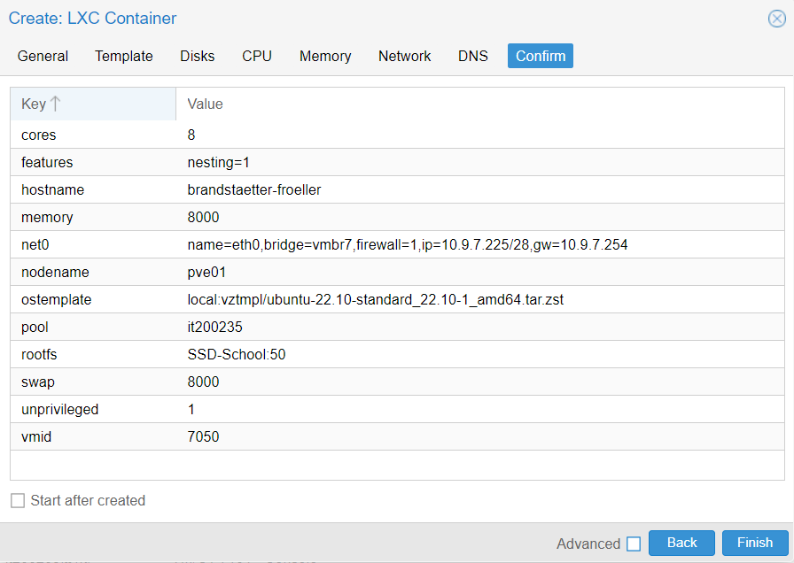
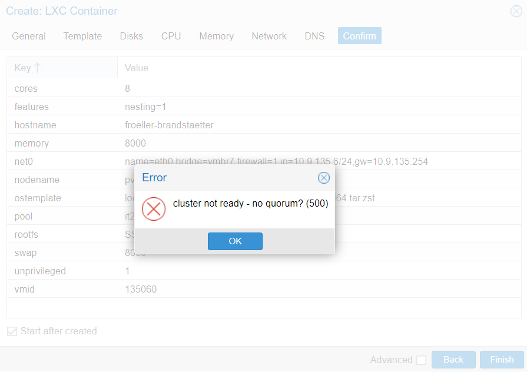
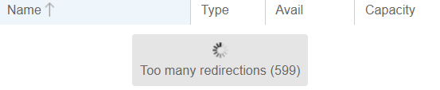

:source-highlighter: highlight.js
:doctype: book
:toc: left
:toclevels: 5
:icons: font
:hide-uri-scheme:

= Proxmox-Project - Phase 1 - Container Erstellung
Elias Brandstaetter & Jonas Froeller
1.0.1, {docdate}: Phase 1

== Einstellungen

== Probleme 

~ falscher Node

== Index
xref:index.adoc[index]